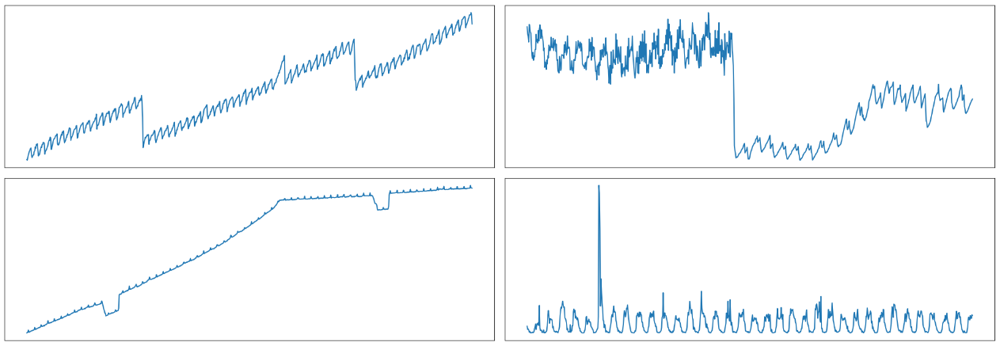

<!-- 
 -->
<!-- <h3>Behind the Secrets of Large Language Models</h3>
<p>Exercise 2</p> -->

### Exercise 2
# Attention for Timeseries Prediction

This time we will learn prediction of time-series data and we will show you 
how to implement attention and how it can be used for this application.

- [Attention for Timeseries Prediction](#attention-for-timeseries-prediction)
  - [HPC Quickstart](#hpc-quickstart)
    - [Task 0: Run a Notebook on HPC](#task-0-run-a-notebook-on-hpc)
  - [PANJAPAN Dataset](#panjapan-dataset)
    - [Task 1: Read and Prepare the Dataset](#task-1-read-and-prepare-the-dataset)
  - [Build and Train an RNN](#build-and-train-an-rnn)
    - [Task 2: Write a simple LSTM model](#task-2-write-a-simple-lstm-model)
    - [Task 3: Train your LSTM model](#task-3-train-your-lstm-model)
    - [Task 4: Inference and Plot Results](#task-4-inference-and-plot-results)

## HPC Quickstart

We assume you have signed up on the HPC with the link/QR-code provided.
Read the [HPC Quickstart guide](https://doc.zih.tu-dresden.de/access/jupyterhub/) 
and ensure that you are able to login to jupyterhub.hpc.tu-dresden.de 
with your ZIH login credentials, as well as login via `ssh`.

```bash
ssh login2.alpha.hpc.tu-dresden.de -l <ZIH-Login>
```

Your personal data like code, notebooks, plots, datasets you downloaded etc. should be kept in your home directory `/home/<ZIH-Login>`.
The project directory is available for project data that you want to share with other project members `/projects/p_scads_llm_secrets`. Note that this is a read-only directory.

> **Note: Login to the HPC is only possible on the university network or via the [VPN][vpn]**

### Task 0: Run a Notebook on HPC
Once you are able to create a Jupyter instance on the HPC, use the 
[notebook from Exercise 1](https://bildungsportal.sachsen.de/opal/auth/RepositoryEntry/46076788747/CourseNode/1728959390807630005)
on the basics of PyTorch and building neural networks to validate that everything works.
1. Upload the notebook to your home directory via the JupyterHub web interface.
2. Select the "PyTorch 2.0" environment for the notebook. 
3. Run the whole notebook and check that everything works.

## PANJAPAN Dataset
We will use a time-series dataset called PANJAPAN.
You can clone the [dataset from Huggingface](https://huggingface.co/datasets/zrthxn/PANJAPAN) with `git clone git@hf.co:datasets/zrthxn/PANJAPAN`

On the HPC, the dataset is already available under `/projects/p_scads_llm_secrets/datasets/PANJAPAN`

The dataset contains many samples of time-series like these in CSV files. Each file has a 
value column and a timestamp column. Many of the time-series here have seasonalities which 
we should be able to predict with our neural netowork.

Here is what these look like


### Task 1: Read and Prepare the Dataset
The easiest way to read the dataset is with `pandas.read_csv`, and later convert each
time-series to numpy arrays. To do this, you can use the following snippet.

```py
import numpy as np
import pandas as pd

timeseries = []

DATAPATH = "/projects/p_scads_llm_secrets/datasets/PANJAPAN/benchmarking"
for path in os.listdir(DATAPATH):
  # Filter out only CSVs and use only those with 840 points
  if path.endswith(".csv") and \
      (df := pd.read_csv(DATAPATH / path).to_numpy()).shape == (840, 2):
    timeseries.append(df)

timeseries = np.array(timeseries)
```

Since each time-series can be of a variable size, here we are also filtering out only CSVs 
and we are use only those time-series with 840 points for ease of code later.
We have provided a notebook with some starter code to preprocess the dataset until a point
that you can start using it to train a neural network.

## Build and Train an RNN
Recurrent Neural Networks are a common architecture to transform sequences. Vanilla RNNs 
suffer from the problem of vanishing gradient, where the gradient of loss becomes too 
small over many time steps to be useful for training. 
Thus these are rarely used, in favour of LSTM or GRU which are more common.

### Task 2: Write a simple LSTM model
Using PyTorch, write a very simple LSTM model that takes in a sequence of values and returns another sequence. The input sequence of values is called "backcast" or "horizon",
and the output sequence of values is the forecast.

```
    |<--------backcast-------->|<--forecast-->|
... * * * * * * * * * * * * * * # # # # # # # # ... values
```

Use the LSTM layer and a linear layer from `torch.nn` in your model with a configurable
output size. The `input_size` parameter of the LSTM layer will always be 1 since we are 
using scalar time-series values, i.e. with only 1 dimension.

```py
from torch import nn

class LSTM(nn.Module):
  def __init__(self, output_size):
    super().__init__()
    
    # TODO: Use the LSTM layer and a linear layer from torch.nn
  
  def forward(self, seq):
    # TODO: Write a forward pass through the 
    #       LSTM layer and then a linear layer

    return prediction

rnn = LSTM(output_size = ...)
```
Read the [PyTorch LSTM documentation][torch.nn.lstm] to learn how to use this layer.

### Task 3: Train your LSTM model
Now write a training loop that will iterate over the training time-seris, create 
sliding windowed views from the time-series and use these as training samples.

Each window will have the size `[BACKCAST_SIZE + FORECAST_SIZE]`.
For details, refer to the preprocessing notebook provided.

```py
from torch.optim import Adam

rnn_model = LSTM(out_size = FORECAST_SIZE)
optimizer = Adam(params=rnn.parameters(), lr=2e-3)

for epoch in range(EPOCHS := 5):
  dataset = []
  for series in train_dataset:
    dataset.extend(create_windows(series))

  train_dataloader = DataLoader(dataset, shuffle=True, batch_size=24)
  for i, batch in tqdm(enumerate(train_dataloader), desc=f"Epoch {epoch}/{EPOCHS}"):
    optimizer.zero_grad()
    # TODO: Complete the training loop
    ...
```
Refer to this [LSTM tutorial][lstm-tutorial] for help on how to implement a training loop.
In the end you should be able to train this model and observe a decrease in the loss of the
model as you train it. We recommend that you plot your loss values with `matplotlib`.

### Task 4: Inference and Plot Results
Finally, once you have been able to train this model, you should now be able to validate
its results using the test split. Iterate over the `test_dataset` and create sliding
windows similar to how you did so for training time-series.

Using these you can get predictions for the whole time-series. Plot these along with the
true value of the time-series and see how they compare. 
- Are the predictions close to the test time-series? Where does this model fail? 
- Is the model performing better on some time-series than others?
- What happens when you increase the size of forecast?
- What happens when you use the model's own predictions to make the next prediction?


<!-- links -->
[vpn]: https://tu-dresden.de/zih/dienste/service-katalog/arbeitsumgebung/zugang_datennetz/vpn
[torch.nn.lstm]: https://pytorch.org/docs/stable/generated/torch.nn.LSTM.html
[tutorial-rnns]: https://pytorch.org/tutorials/beginner/nlp/sequence_models_tutorial.html
[recurrent-layers]: https://pytorch.org/tutorials/beginner/introyt/modelsyt_tutorial.html#recurrent-layers
[lstm-tutorial]: https://machinelearningmastery.com/lstm-for-time-series-prediction-in-pytorch/