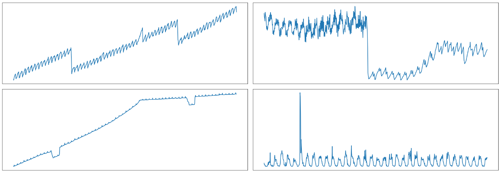

<!-- 
 -->
<!-- <h3>Behind the Secrets of Large Language Models</h3>
<p>Exercise 2</p> -->

### Exercise 2
# Attention for Timeseries Prediction

- [Attention for Timeseries Prediction](#attention-for-timeseries-prediction)
  - [HPC Quickstart](#hpc-quickstart)
    - [Login](#login)
    - [Environment](#environment)
  - [Prepare the Dataset](#prepare-the-dataset)
  - [Build and Train an RNN](#build-and-train-an-rnn)
    - [Sequence-to-Sequence Models](#sequence-to-sequence-models)
    - [Training](#training)
    - [Plot results on test set](#plot-results-on-test-set)

This time we will learn how to implement attention and how it can improve prediction of timeseries data.

## HPC Quickstart

### Login
We assume you have signed up on the HPC with the link/QR-code provided.
Read the HPC Quickstart guide that we have prepared and ensure that you are able to login to jupyterhub.hpc.tu-dresden.de 
with your ZIH login credentials, as well as login via `ssh`.

```bash
ssh login2.alpha.hpc.tu-dresden.de -l <ZIH-Login>
```

Your personal data like code, notebooks, plots, datasets you downloaded etc. should be kept in your home directory `/home/<ZIH-Login>`.
The project directory is available for project data that you want to share with other project members `/projects/p_scads_llm_secrets`.

### Environment
To run code 

## Prepare the Dataset
We will use a timeseries dataset called PANJAPAN.
You can download the dataset from Huggingface: LINK.
The dataset is already available on the HPC under `/projects/p_scads_llm_secrets/datasets`

Here is what the timeseries look like. 

The dataset contains many samples of timeseries like these.
Read this using pandas and pre-process it to be ready for training.

```python
def read_data():
    ...
```

## Build and Train an RNN
RNNs have are oldest architecture for sequence-to-sequence models.

### Sequence-to-Sequence Models
...

### Training
We will now and a training loop for the dataset

### Plot results on test set

