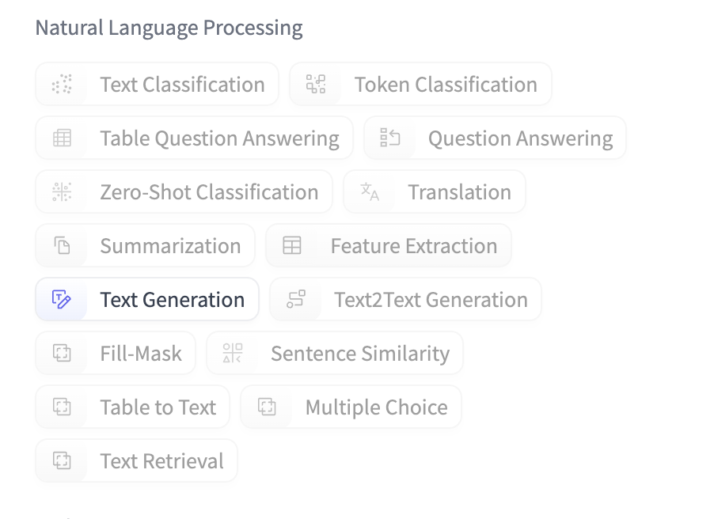
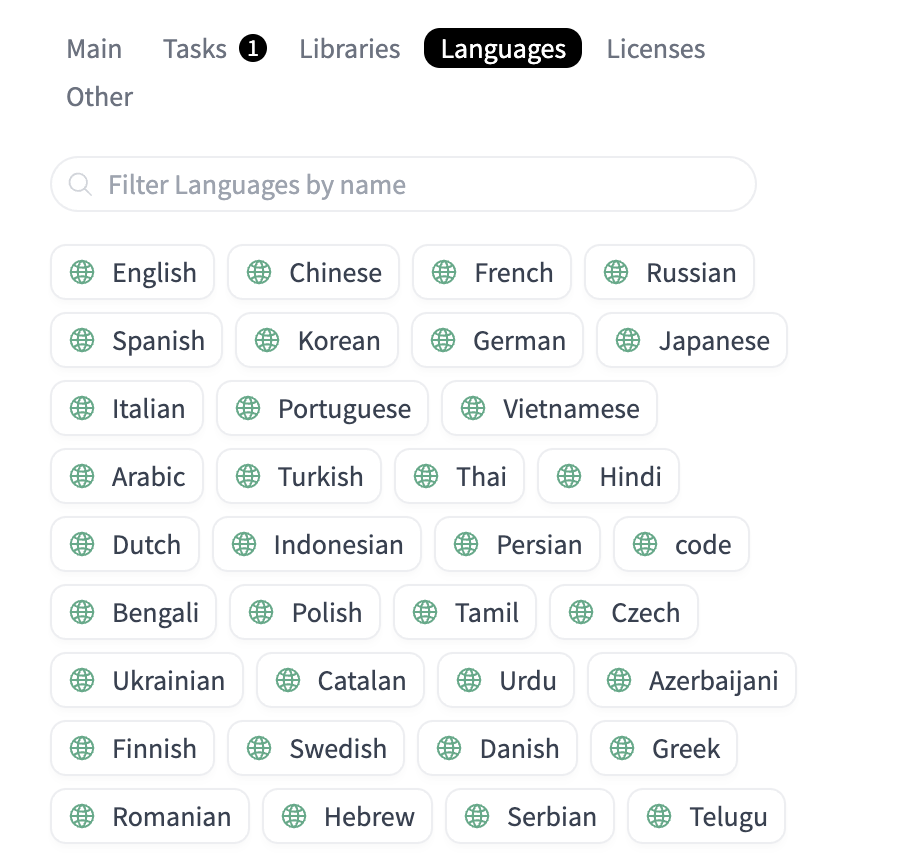

### Exercise 4
# Training a Language Model

This time we will learn prediction of time-series data and we will show you 
how to implement attention and how it can be used for this application.

## Finding a Dataset

The most popular website for NLP datasets is [HuggingFace](huggingface.co).
For this task we recommend that you try to find a dataset in your language or a language you understand.

1. Go to https://huggingface.co/datasets
2. Under **Main** in first filter by Modalities, select **Text**. 
   Under **Tasks**, select **Text Generation**. 
   Under **Libraries**, select **Datasets**.
3. Under **Languages** select your language. This should now give you a list of suitable datasets that we can use.
4. Choose any of the datasets you see which is not too big in size and check it's description
   for how to load the dataset. This may be different for different datasets. 

    
    

Other interesting ideas for datasets may be code datasets, math datasets, song lyrics datasets.
Finding and getting them ready for use may be more work but it is a good exercise.
Remember that a machine learning model is only as good as the dataset it uses.

## Loading and Running

The example in the accompanying notebook will show a Wikipedia dataset in Belarusian.

## Training

## Evaluation
