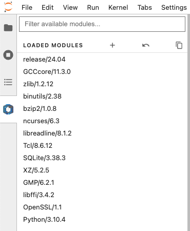
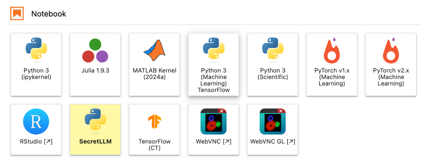

# Instructions for a Shared Jupyter Kernel
Until now we have had a few issues with missing packages in existing kernels provided on JupyterHub.
We will now create a shared Jupyter kernel so that everyone has the same working environment with all required packages installed already.

## Create a New Jupyter Kernel
Frist, login via SSh and register the shared virtual environment as a Jupyter kernel.
This only needs to be done once.

1. Navigate to the project directory and activate the virtual environment
```sh
cd /projects/p_scads_llm_secrets
source kernel/bin/activate
```

2. Create a new kernel with the name "SecretLLM" (or another name of your choice)
```sh
python -m ipykernel install --user --name "SecretLLM"
```

3. Now you can logout by running `logout`.

## Load Modules
Now open [JupyterHub](jupyterhub) and creat a runtime, where we will load some [modules](docs-modules).
This is so that our Python packages can find the required shared object files.

<table>
<style>
td, tr {
   border: none!important;
}
</style>
<tr>
<td>

Do not create a notebook right now. Open the "Softwares" panel on the left side. 

In this panel you can simply load modules by clicking "Load" on the name of the module.
We need to load the following two modules:
- **GCCcore/11.3.0**
- **Python/3.10.4**

All the other dependencies of these modules will be loaded automatically.

</td>
<td>



</td>
</tr>
</table>
This step must be done each time you want to 

## Select your new Kernel
Once you have loaded these modules, you should see the **SecretLLM** kernel that we had created in the 
first step in the Launcher tab.



Now upload the given notebooks as usual and select this shared kernel for all of them. 
All the packages that we need are already installed in this kernel. You should also be able to install more packages.

<!-- Links -->
[jupyterhub]: [https://jupyterhub.hpc.tu-dresden.de/]
[docs-modules]: https://compendium.hpc.tu-dresden.de/software/modules/?h=modules


### Common Problems

- **Cannot open directory /projects/p_scads_llm_secrets: Permission Denied** 
    > You are probably not signed up to our HPC project. Every member of the project can access this directory.
- **Cannot open libffi.so.8: No such file or directory**
    > You probably didn't load the Python/3.10.4 module. `libffi` is a DLL required by Python.
    > If you loaded the module you need to shut down the kernel and start another one.